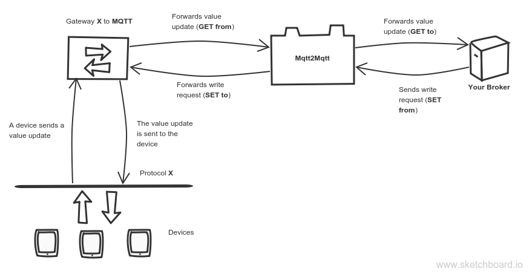
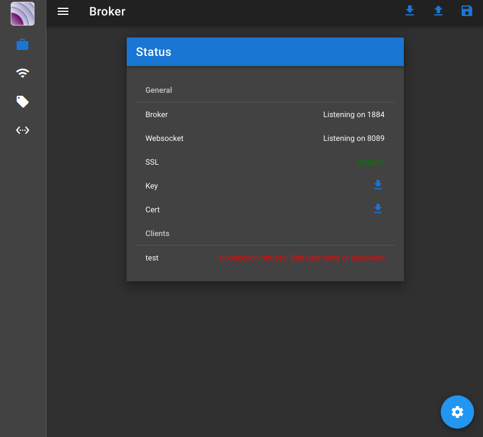
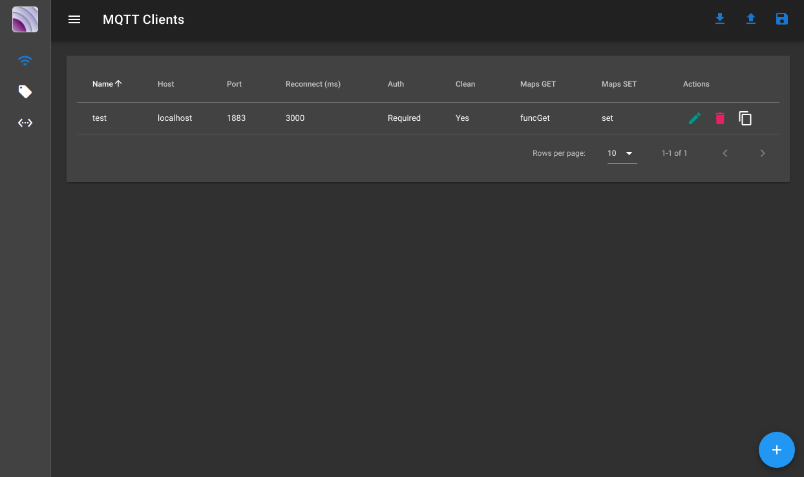
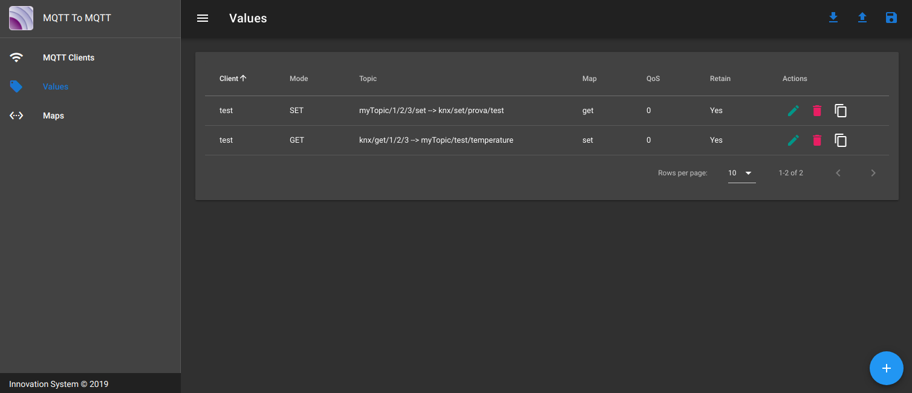
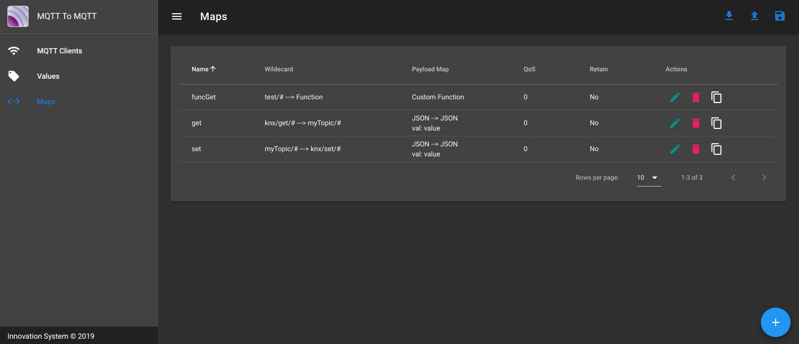
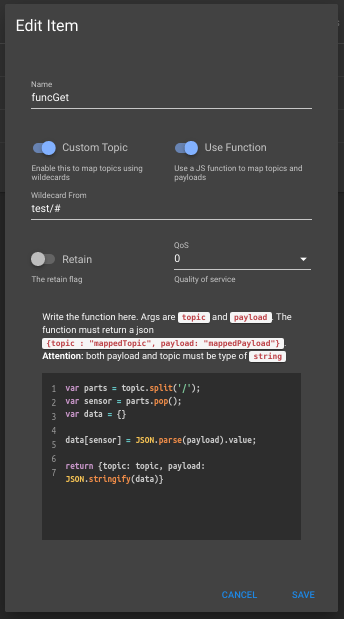

# Mqtt To Mqtt


Fully configurable Mqtt to Mqtt gateway.

- **Backend**: NodeJS, Express, Mqttjs, Aedes Mqtt Broker, Webpack
- **Frontend**: Vue, [Vuetify](https://github.com/vuetifyjs/vuetify)

## Why

There is almost an MQTT gateway for every protocol out there.

The problem is every gateway maps reads and writes in different ways depending on the protocol used. There isn't a standard way to map a protocol in MQTT topics and also there isn't a standard payload, some sends a JSON payload with different properties (like `val` or `value` or `data` for the value and `tms` `time` `timestamp` for the timestamp/date), others use a payload with just a numeric value.

This gateway inits an MQTT broker that sits between your MQTT gateways (or devices) and your broker to parse incoming/outgoing MQTT messages from/to your broker in the format you need.

Here is an example schema of how it works:



Note here there are some bold text **GET/SET** **from/to**. More about them in docs

## :electric_plug: Installation

``` bash
# Clone repo
git clone https://github.com/robertsLando/

cd Mqtt2Mqtt

# install dependencies
npm install

# build for production with minification
npm run build

# Start the server
npm start
```

## Usage

Once the app is running open the web browser to <http://localhost:8100.> Here you need to declare the Broker settings, Mqtt clients, the maps and (optionally) the values.

### Broker settings

Used to set up the MQTT Broker

- **Port**: The port where the broker will listen for incoming connections
- **Websocket**: Enable this to enable MQTT over websockets
- **Websocket Port**:  The port where the websocket server will listen for incoming connections
- **Require auth**: Enable this to enable broker authentication check
- **Username/Password**: If auth is enabled insert here the username and the password to connect to this broker.
- **SSL**: Enable this to enable SSL
- **Self-Signed Certs**: When ssl is enabled, enable to allow self-signed certificates (used to set the flag `rejectAnauthorized`).
- **Auto-generate certs**: When ssl is enabled, flag this to auto-generate certificates
- **Key.pem/Cert.pem**: If auto-generate is disabled insert here the key and the certs files

### MQTT Clients

Used to init a connection to an MQTT broker

- **Name**: A unique name that identify the Client.
- **Host**: The url to the broker
- **Port**: Broker port
- **Reconnect period**: Milliseconds between two reconnection tries
- **Store**: Enable/Disable persistent storage of packets (QoS > 0). If disabled in memory storage will be used but all packets stored in memory are lost in case of shutdowns or unexpected errors.
- **Clean**: Sets the clean flag when connecting to the broker
- **Auth**: Enable this if broker requires auth. If so you need to enter also a valid **username** and **password**.
- **Maps Get**: List of maps to use for value updates coming from other gateways to forward to your broker
- **Maps Set**: List of maps to use for value writes coming from your broker to forward to the gateways.

## Maps

Set of rules to use for incoming/outgoing packets

- **Name**: A unique name that identify the map.
- **Custom Topic**: Enable this to customize the topic
- **Use function**: Enable this to use a JS function to map topic and payload. The function takes 2 args `topic` and `payload` and expects a returned object like `{topic: "theNewTopic", payload: "theNewPayload"}`. **ATTENTION**: Returned topic and payload must be `string`.

    Example code to write inside the function:

    ```js
    var parts = topic.split('/');
    var sensor = parts.pop();
    var data = {}

    data[sensor] = JSON.parse(payload).value;

    return {topic: topic, payload: JSON.stringify(data)}
    ```

    > This function takes last topic level and uses it as a payload attribute and uses the payload value as value for that attribute.
- **Code**: If both custom Topic and Use functions flag are enabled this field will contain the JS code of the function used to map the topic
- **Wildecard From**: The topic wildecard to use to identify packets that need to be parsed using this map.
- **Wildecard To**: If custom wildecard is enabled this field is used to specify the wildecard to use to transform the original topic to the destination topic (more about this later).
- **From suffix**: The suffix to add to the from wildecard. If a packet topic matches the wildecard but doesn't have this suffix it is discarded. This filed is needed because wildecards like `prefix/#/suffix` are not valid wildecards as after a # char the topic cannot have anything.
- **To suffix**: The suffix to add to the destination topic after the wildecards conversion is done.
- **Retain**: Sets the retain flag of the outgoing packet
- **QoS**: Sets the QoS level of the outgoing packet
- **Payload**: The type of payload conversion.
  - *Keep original*: The payload is not changed
  - *Value --> JSON*: The incoming payload is expected to be a raw value and I want to create a JSON object with a **Value Property** set to that value
  - *JSON --> Value*: The incoming payload is expected to be a JSON Object and I want to send a raw value payload using **Value Property** of original payload
  - *JSON --> JSON*: The incoming payload is expected to be a JSON Object and I want to map properties to another JSON object. If this option is choosed I will need to add a set of property **From** and **To**
- **Add timestamp**: Can be used when destination payload is a JSON object, if enabled I can add a time property (the name of the prioperty needs to be specified in **Time property**) to outgoing packets and the value will be `Date.now()`, the timestamp when the original packet is received.

### Examples

#### Wildecards

| Topic From | Wildecard From | Wildecard To | Topic To       |
| :--------- | :------------- | :----------- | :------------- |
| a/b/c/d/e  | a/b/#          | myprefix/#   | myprefix/c/d/e |
| a/b/c/d/e  | +/b/+/d/e      | myprefix/+/+ | myprefix/a/c   |
| a/b/c/d/e  | +/b/#          | +/my/#       | a/my/c/d/e     |

#### Payload

- **Payload**: Value --> JSON
- **Value Property**: `"myvalue"`

    `25`  --->  `{ "myvalue": 25}`

---

- **Payload**: JSON --> Value
- **Value Property**: `"myvalue"`

    `{ "myvalue": 25}`  --->  `25`

---

- **Payload**: JSON --> JSON
- **Paylod JSON**:

    | From | To    |
    | :--- | :---- |
    | val  | value |
    | tms  | time  |

    `{ "val": 25, "tms": 1556548668373}`  --->  `{ "value": 25, "time": 1556548668373}`

### Values

If you don't want to map all values coming from the gateway but just some values you can add the values you want here using fixed topics instead of wildecards

- **Client**: The Mqtt client to connect to
- **Mode**: Is this value used to *GET* updates from a gateway and forwarding them to your broker or is used to *SET* values? Check the [sketch](#why) for more info about GET and SET
- **Custom Topic**: Enable this to change the original topic
- **Topic**: The topic where messages come from
- **Custom Topic**: If **Custom topic** is enabled here you can add the destination topic where the packet received will be forwarded
- **Retain**: Sets the retain flag of the outgoing packet
- **QoS**: Sets the QoS level of the outgoing packet
- **Payload Map**: Select the map to use to use to parse the payload, all other map values like retain, qos and wildecards are ignored

## :pencil: TODOs

- [ ] Dockerize application
- [x] Package application with PKG
- [ ] Publish/Subscribe topics on UI for testing
- [ ] Unit tests
- [ ] JSON validator for settings

## :camera: Screenshots

### Broker



### Clients



### Values



### Maps



### Map Function



## :bowtie: Author

[Daniel Lando](https://github.com/robertsLando)

Support me on [Patreon](https://www.patreon.com/join/2409916) :heart:
